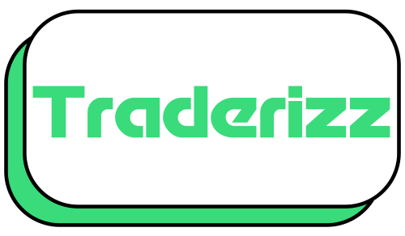

# Traderizz

**Traderizz** is a social app for traders to share and reflect on their journey. Whether you're in the green or red, Traderizz is your space to track trades, celebrate wins, and learn from losses.



---

## Features

- **Main Feed**  
  Users can post profit/loss (P/L) screenshots with captions to share trade results and experiences.

- **Dashboard**  
  A personalized dashboard for tracking past trades, reviewing performance, and staying accountable.

- **Search**  
  Instantly look up stock symbols and explore potential trades with real-time data.

---

## Preview

| Feed Screen | Plot | Search |
|------------|------------|-----------|
|  |  |  |

---

## Prerequisites

To run Traderizz locally, ensure you have the following installed:

- **Node.js** (>= 16)
- **Expo CLI**
- **React Native**
- **Supabase** (hosted project)
- **A Supabase Storage Bucket** named `post-images`

---

## Setup

1. **Clone the repository**

```bash
git clone https://github.com/j24char/traderizz.git
cd traderizz
